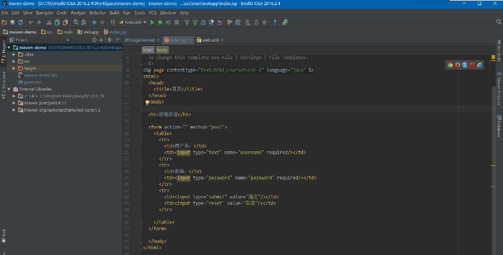
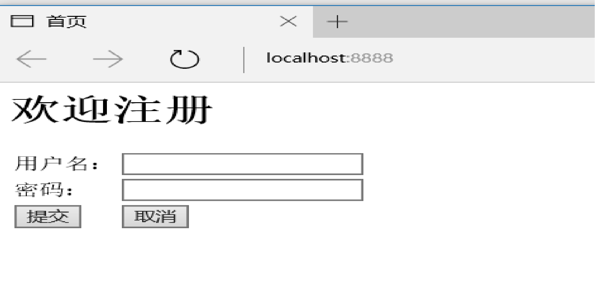
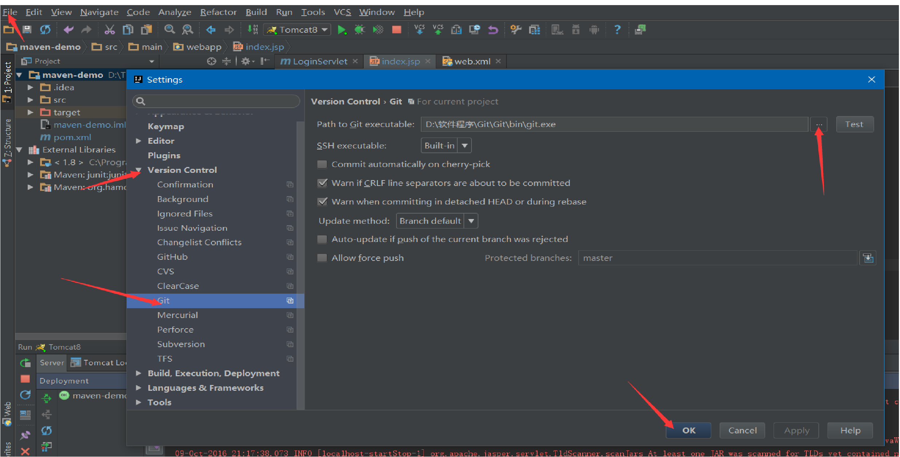
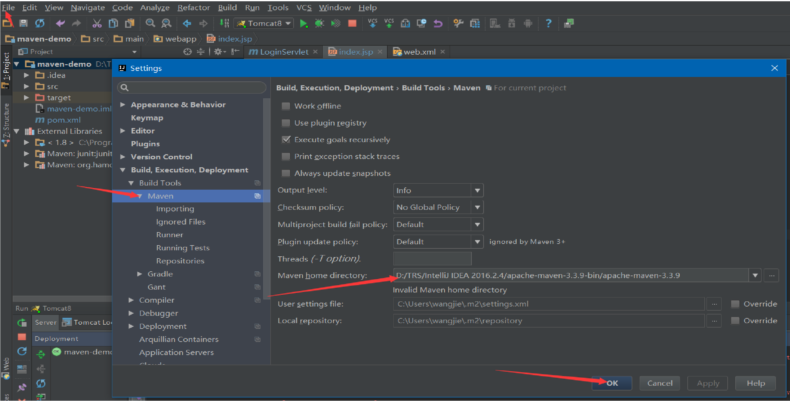
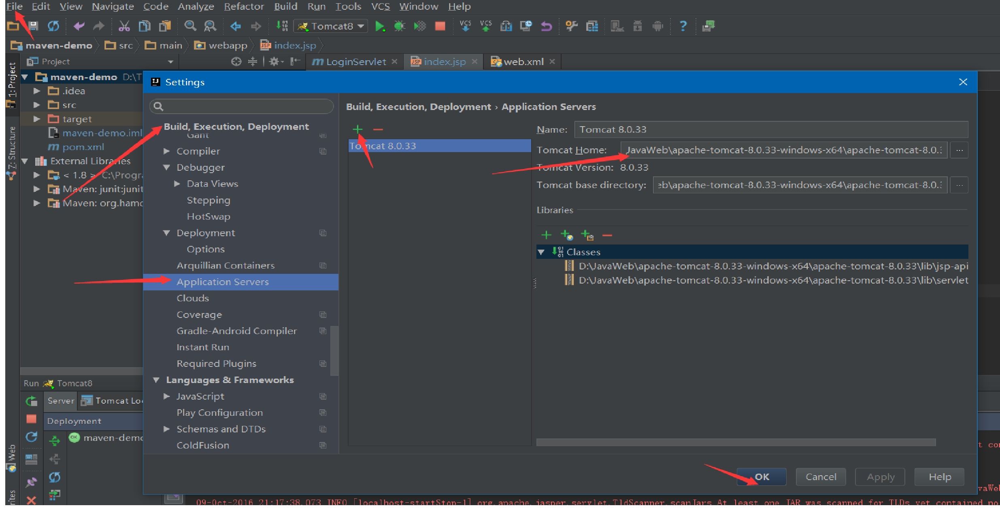
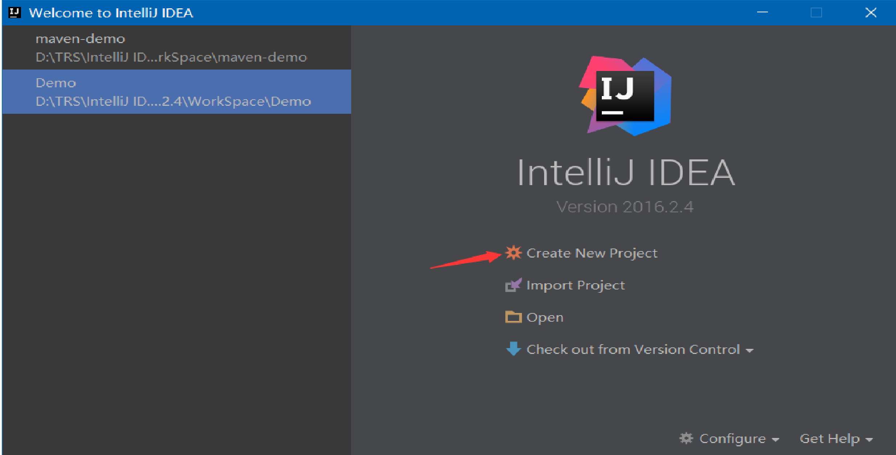
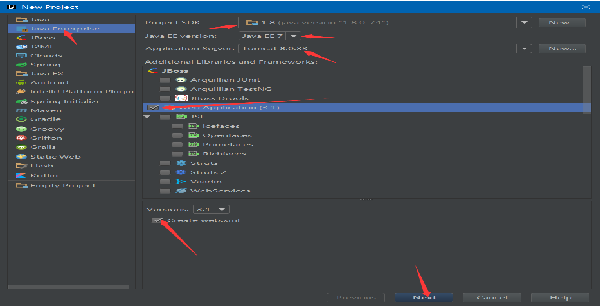

# Study1
## IntelliJ IDEA学习

### 使用IntelliJ IDEA来新建一个使用Maven管理的一个WebApp项目，并使用git来提交到GitHub中。
   具体项目见GitHub地址：https://github.com/WangJieWJ/IntelliJ-IDEA.git
      
   
### 在IntelliJ IDEA中配置git：
   1、选择File中的Setting
   2、Version Control中的git，选择Path to Git executable中选择git bin目录下的git.exe
   
### 在IntelliJ IDEA中配置Maven：
   1、选择File中的Setting
   2、Build,Execution,Deployment---->Build Tools---->Maven,右侧中的Maven home directory选择安装的目录。
   
### 在IntelliJ IDEA中配置Tomcat：
   1、选择File中的Setting
   2、Build,Execution,Deployment---->Deployment---->Application Servers,点击添加按钮，添加Tomcat的安装目录。
   
### 创建使用Maven管理的WabApp项目：
  1、新建项目New Project
  2、选择Java Enterprise，并在右侧选择合适的Java EE版本、Application Server、并在下面的Additional Libraries and Framrworks中选择Web Application。
  3、之后再输入项目的名称等基本信息。
   
   
