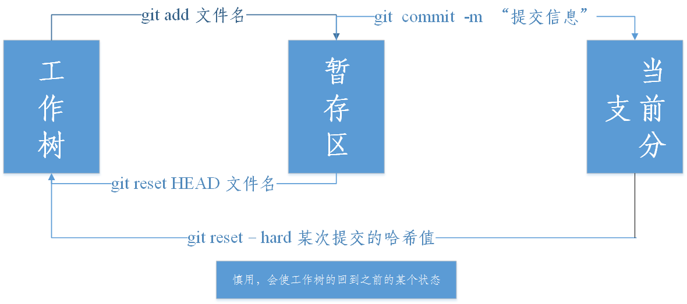

# Study1
## git学习(Bash)



```bash
# 初始化仓库，在需要使用git来管理的项目目录中，使用此命令来初始化仓库。
$ git init
```

```bash
# 查看仓库的状态.
$ git status
```

```bash
向暂存区中添加文件
$ git add
```

```bash
一次性加入当前目录中的全部文件
$ git add .
```

```bash
使用互动模式来提交文件
$ git add –i 
```

```bash
保存仓库的历史纪录
$ git commit -m "提交信息简介" 
```

```bash
查看工作树与暂存区的差别
$ git diff
```

```bash
查看工作树与最新提交的差别
$ git diff HEAD
```

```bash
查看提交日志
$ git log
只显示提交信息的第一行
$ git log --pretty=short
只显示指定目录、文件的日志
$ git log 文件名
显示指定文件的改动，查看提交所带来的影响
$ git log -p 文件名
```

```bash
显示分支览表，将会列出当前所有分支，左侧标有*表示当前所在分支
$ git branch
```

```bash
创建、切换分支，若分支存在，则直接切换，若分支不存在则创建并切换，
$ git checkout –b 分支名称
等同于：
$ git branch 分支名称
$ git checkout 分支名称
```

 ```bash
 合并分支
$ git merge
 ```
 
 ```bash
 添加远程仓库,之后就可以使用主机名来代替远程仓库
 $ git remote add 主机名 远程仓库的地址
 列出所有远程主机。
 $ git remote
 列出所有主机的名称和对应的网址
 $ git remote -v
 可以查看该主机的详细信息
 $ git remote show 主机名
 删除远程主机
 $ git remote rm 主机名
 对远程主机的改名
 git remote rename 机原主名 新主机名
 ```
 
 ```bash
 将master分支提交的历史记录推送至远程仓库GitHub
 $ git push -u 主机名 master
 将本地仓库的某个分支与远程主机的某个分支合并。
 $ git push 主机名 本地分支名称：远程主机名称
 ```

 ```bash
 查看当前仓库执行过的操作的日志，会显示当前仓库所有操作和对应的哈希值，可以使用下面命令
 $ git reflog
 推进至历史的某个状态
 $ git reset --hard 哈希值
 ```
 
 ```bash
 将远程仓库的某个分支中的文件下载到本地(本地没有此分支)
 $ git checkout -b  新的分支名称 主机名/要下载到本地的分支名称
 ```
 
 ```bash
 从远程仓库获取最新的此分支的最新状态与本地的分支合并。
 $ git pull 主机名 远程分支名称：本地分支名称
 ```

```bash
 直接从远程仓库下载一个新的项目(本地没有此项目),该命令会在本地主机生成一个目录，与远程主机的版本库同名
 $ git clone  版本库地址
 如果要指定不同的目录名，可以将目录名作为git clone命令的第二个参数。
 $ git clone https://github.com/WangJieWJ/IntelliJ-IDEA.git download
```

```bash
取回该远程主机中的所有分支的更新到本地
$ git fetch 远程主机
取回该远程主机中的特定分支的更新
$ git fetch 远程主机名 分支名：
```


进阶网址：
- ProGit中文版 [ProGit中文版](https://git-scm.com/book/zh/v2)
- 廖雪峰的Git教程 [廖雪峰的Git教程](http://www.liaoxuefeng.com/wiki/0013739516305929606dd18361248578c67b8067c8c017b000)
- Git简易指南 [Git简易指南](http://rogerdudler.github.io/git-guide/index.zh.html)
